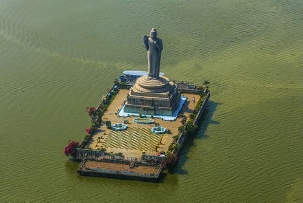

# Visit Hyderabad

Welcome to Visit Hyderabad! This website serves as a guide to discovering the rich cultural heritage, historical landmarks, and vibrant attractions of Hyderabad, India.

## Overview

Explore Hyderabad is a comprehensive website dedicated to showcasing the iconic landmarks, historical monuments, and vibrant culture of Hyderabad. Whether you're a local resident or a tourist visiting the city, our website provides detailed information about must-visit places, including Charminar, Golconda Fort, and more.

## Website Design

Our website is designed with user experience in mind. Here's what you can expect:

- **Responsive Layout:** Enjoy a seamless browsing experience across devices, including desktops, tablets, and smartphones.
- **Interactive Features:** Explore interactive maps, image galleries, and dropdown sections for each place to enhance your exploration of Hyderabad.
- **Engaging Content:** Discover detailed descriptions, stunning images, and essential information about each landmark to plan your visit effectively.

- **Design Files**

  ### Mobile View

    

    
Home

    
    

    

    
Places

    
    

    

    
Detail Places

    
    

  ### Desktop View

    

    
Home

    
    

    

    
Places

    
    

    

    
Detail Places

    
    

## Places to Explore

Charminar

Charminar, built in 1591 by Sultan Muhammad Quli Qutb Shah, is a majestic monument and mosque located in the heart of Hyderabad. It is renowned for its stunning architecture, featuring four grand arches adorned with intricate designs and minarets offering panoramic views of the bustling city. Charminar is not only a symbol of Hyderabad but also a bustling center of activity, surrounded by vibrant markets selling traditional jewelry, textiles, and street food.

Golconda Fort

Golconda Fort, originally built in the 13th century and later expanded by the Qutb Shahi dynasty, is a sprawling fortress located on the outskirts of Hyderabad. The fort complex encompasses majestic gates, royal palaces, and an ingenious water supply system. Visitors can explore the impressive ramparts, climb to the top for breathtaking views of the surrounding landscape, and learn about the fort's rich history, including its role as a center of diamond trade.

Hussain Sagar

Hussain Sagar is a large artificial lake built in 1563 during the reign of Ibrahim Quli Qutb Shah. The centerpiece of the lake is the towering Buddha statue, installed in 1992 as a symbol of peace and harmony. Visitors can enjoy leisurely boat rides on the lake, take in the scenic views of the city skyline, and relax in the landscaped parks surrounding the waterfront.

Birla Mandir

Birla Mandir, also known as the Birla Temple, is a magnificent Hindu temple dedicated to Lord Venkateswara. Perched atop a hillock overlooking the city, the temple is constructed entirely of white marble and features intricate carvings depicting scenes from Hindu mythology. Visitors can marvel at the temple's architectural beauty, offer prayers in the sanctum sanctorum, and enjoy panoramic views of Hyderabad from the temple premises.

Ramoji Film City

Ramoji Film City is the world's largest integrated film studio complex, spread over thousands of acres on the outskirts of Hyderabad. It is a popular tourist destination and a hub of film production in India. Visitors can explore film sets, gardens, amusement parks, and entertainment attractions within the sprawling premises, offering a glimpse behind the scenes of the Indian film industry.

Chowmahalla Palace

Chowmahalla Palace, built in the 18th century by the Nizams of Hyderabad, is a grand royal palace known for its exquisite architecture and opulent interiors. The palace complex comprises several elegant buildings, including the Khilwat Mubarak, Council Hall, and Clock Tower. Visitors can admire the intricate stucco work, ornate chandeliers, and vintage carriages on display, offering a glimpse into the luxurious lifestyle of the Nizams.

Salar Jung Museum

Salar Jung Museum is one of India's premier art and history museums, located on the southern bank of the Musi River. It houses a vast collection of paintings, sculptures, manuscripts, textiles, and artifacts from around the world, amassed by the Salar Jung family over several generations. Visitors can explore the museum's diverse exhibits, including the famous Veiled Rebecca sculpture and the mesmerizing musical clock.

Nehru Zoological Park

Nehru Zoological Park is a sprawling wildlife sanctuary spread over 380 acres in the heart of Hyderabad. It is home to a diverse range of animal species, including mammals, birds, reptiles, and amphibians, housed in naturalistic enclosures. Visitors can embark on safari rides, attend animal shows, and learn about wildlife conservation efforts at the zoo, making it a popular destination for families and nature enthusiasts.

Qutb Shahi Tombs

Qutb Shahi Tombs are a group of majestic mausoleums built to house the remains of the rulers of the Qutb Shahi dynasty. Located near the Golconda Fort, the tombs showcase a unique blend of Persian, Indian, and Islamic architectural styles. Visitors can explore the intricately carved tombs, pavilions, and gardens, paying homage to the illustrious rulers who shaped the history of Hyderabad.

Laad Bazaar

Laad Bazaar, also known as Choodi Bazaar, is a bustling market located near the Charminar. It is famous for its vibrant display of lacquer bangles, traditional jewelry, bridal wear, and embroidered fabrics. Visitors can immerse themselves in the bustling atmosphere, haggle with local vendors, and shop for souvenirs, offering a sensory feast of colors, sounds, and aromas.

## Features

- **Discover Iconic Landmarks:** Explore detailed descriptions and stunning images of Hyderabad's most famous landmarks.
- **Details About Places:** Get comprehensive information about each location, including historical significance, architectural details, and nearby attractions.
- **User-Friendly UI:** Enjoy a seamless browsing experience with an intuitive interface designed for ease of navigation and accessibility.
- **Interactive Maps:** Access interactive maps for each place, allowing you to visualize the location, nearby amenities, and points of interest.